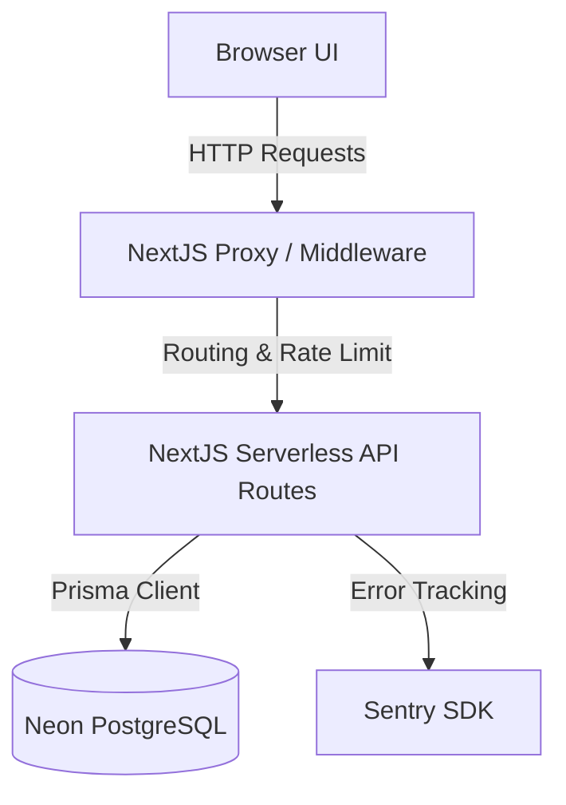

# Architecture Design Document 🏗️

This document outlines the software architecture and security designs implemented in **Yoshlar Qalqoni AI**.

---

## 1. System Overview

The platform is designed as a full-stack monolithic Next.js application that runs on serverless architecture (Vercel) and communicates with a managed serverless database (Neon PostgreSQL).



---

## 2. Security Architecture

Security is designed defensively using multi-layered authentication, session validation, request throttling, and brute-force lockouts.

### A. JWT Auth & Session Model
We use a dual-token (Access + Refresh) security model stored in secure, HttpOnly, SameSite=Strict cookies:
- **Access Token:** Expiration: 15 minutes. Contains user payload (ID, username, role, avatar). Signed with HS256.
- **Refresh Token:** Expiration: 7 days. Signed with HS256.

```text
User Login -> Generate Access & Refresh Tokens
           -> Hash Refresh Token (SHA-256)
           -> Store Hashed Refresh Token in DB Session Table
           -> Set HttpOnly Cookies on Response
```

When a user requests a new Access Token:
1. The app verifies the signature of the incoming Refresh Token.
2. It hashes the incoming Refresh Token with SHA-256.
3. It performs a direct lookup (`prisma.session.findUnique`) using the SHA-256 hash.
4. If a match is found and not expired, a new Access Token is issued. This eliminates the slow Bcrypt loops, ensuring sub-2ms response times.

### B. IP-Independent Device Fingerprinting
To prevent cookie theft/session hijacking, we generate a device fingerprint on every request:
$$\text{Fingerprint} = \text{SHA256}(\text{User-Agent} + \text{Accept-Language} + \text{Platform})$$

- **Fingerprint Match:** Checked on token refresh. If the fingerprint changes, the session is immediately revoked (deleted from the database) and an security audit alert is registered.
- **IP Change Warning:** If only the client IP changes (e.g. Wi-Fi to cellular) but the fingerprint remains identical, the session remains active but a security warning is logged.

### C. Brute-Force Lockout Engine
Brute force protection is implemented at two levels:
1. **IP-only lockout:** If any single IP address triggers 20 failed login attempts across any usernames, the IP is locked out for 1 hour.
2. **Username + IP combination lockout:** If a specific user name from a specific IP triggers 5 failed attempts, the combination is locked out using exponential backoff:
   - 1st lockout: 15 minutes
   - 2nd lockout: 30 minutes
   - 3rd lockout: 1 hour
   - 4th lockout: 6 hours
   - 5th+ lockout: 12 hours

---

## 3. Database Layer & Soft Deletions

We use **Prisma ORM** as the query builder and migration tool.

### Soft Deletion Pattern
To prevent accidental loss of historical records and maintain relational integrity:
- Models (`YouthProfile`, `Incident`, `Appeal`) include a nullable `deletedAt DateTime?` field.
- **GET Queries:** Automatically filter records where `deletedAt: null`.
- **DELETE Requests:** Instead of `prisma.model.delete()`, we run `prisma.model.update({ data: { deletedAt: new Date() } })`.

### Query Optimizations & Indexes
To ensure sub-second response times on heavy analytics queries, indexing is set up on:
- `AuditLog(userId)` - Optimized for user activity tracking logs.
- `Incident(createdAt)` - Optimized for timeline analytics.
- `Appeal(createdAt)` - Optimized for appeal trends.

---

## 4. API Throttling (Rate Limiting)

Rate limiting is handled at the application layer via an **in-memory Token Bucket** algorithm:
- Rate limit configuration: **100 requests per minute** per IP address.
- Refill rate: 1 token every 600ms.
- Enforced on high-impact endpoints: `/api/auth/login`, `/api/chat` (AI).

---

## 5. Audit Logging Architecture

Every mutation (creation, modification, deletion) or security-sensitive action (login, logout, session revocation) creates a structured audit record:
- Logs are saved in the `AuditLog` table.
- Details are stored in a schema-less `Json` field.
- **AI Logging Policy:** To respect privacy regulations, the chat helper (`/api/chat`) logs only metadata (token count, analytical category, execution status) and **never** records the raw query text or AI response.
